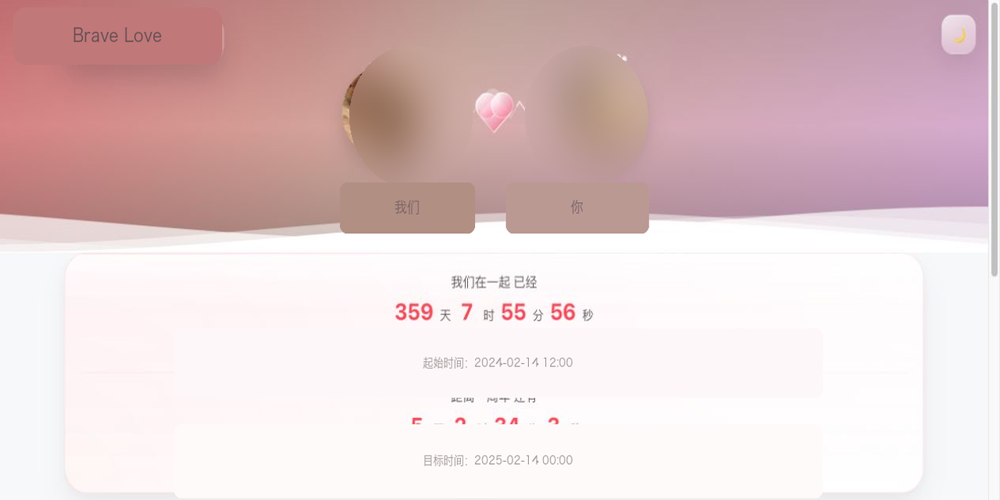

# Brave Love

情侣纪念站 WordPress 主题。An editorial WordPress theme for couples to keep stories, photos, lists, and everyday notes.

[产品介绍](https://www.1ink.ink/archives/733) · [下载主题](https://github.com/unclecat/brave-love/releases) · [使用手册](./docs/USER-GUIDE.md)

WordPress 后台显示的主题名是 **Brave Love**。安装包目录是 `brave-love/`。GitHub 仓库是 `brave-love`。

## 它能做什么

给两个人搭一个能长期维护的纪念站，而不是一张静态落地页：

- 首页：恋爱计时、天气、纪念日和六个入口
- 关于我们：故事时间线
- 旅行计划：行程、足迹和每日安排
- 点点滴滴：按年份归档的长记录，照片会自动进入相册
- 恋爱清单：想做的事和已经完成的事
- 随笔说说：短内容和前台快捷发布
- 祝福留言：基于 WordPress 评论，默认先审核再展示

完整字段、模板对应关系和后台入口见 [用户手册](./docs/USER-GUIDE.md)。设置面板速查图：[docs/images/customizer-quick-reference.svg](./docs/images/customizer-quick-reference.svg)。

## 要求

- WordPress 6.0+
- PHP 7.4+
- 推荐固定链接和 HTTPS

## 安装

1. 从 [Releases](https://github.com/unclecat/brave-love/releases) 下载 `brave-love.zip`
2. WordPress 后台：`外观 -> 主题 -> 添加主题 -> 上传主题`
3. 启用 **Brave Love**
4. 到 `设置 -> 固定链接` 点一次“保存更改”

然后创建首页、关于我们、旅行计划、点点滴滴、甜蜜相册、随笔说说、祝福留言这 7 个页面并分配对应模板，把首页设为静态首页。细节逐步说明在手册里。

## 文档

- 使用手册：[`docs/USER-GUIDE.md`](./docs/USER-GUIDE.md)
- 更新日志：[`CHANGELOG.md`](./CHANGELOG.md)
- 当前版本说明：[`RELEASE.md`](./RELEASE.md)
- 仓库：<https://github.com/unclecat/brave-love>
- 作者站点：<https://www.1ink.ink/>

## License

GPL v2 or later。完整文本见 [LICENSE](./LICENSE)。

